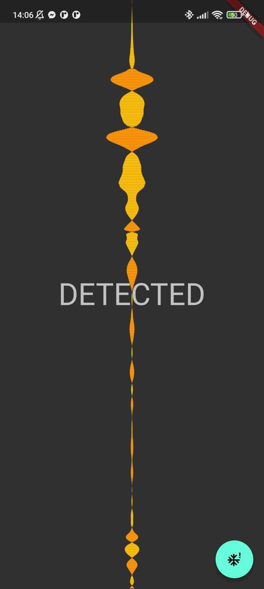
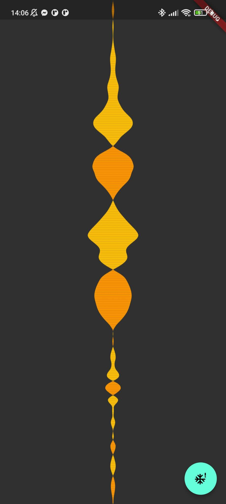

# knock_mock

## This app shows changes of phone X rotation from gyroscope and detects when someone knocks on the back of the phone twice.

 |  |  | 
 |-|-|

This app is just an unoptimized battery-draining experiment and should NOT be used in any way. Only works on android and to use it you have to add `<uses-permission android:name="android.permission.HIGH_SAMPLING_RATE_SENSORS"/>` to AndroidManifest and change gyroscope refresh rate inside sensors_plus' code to `SensorManager.SENSOR_DELAY_FASTEST`.